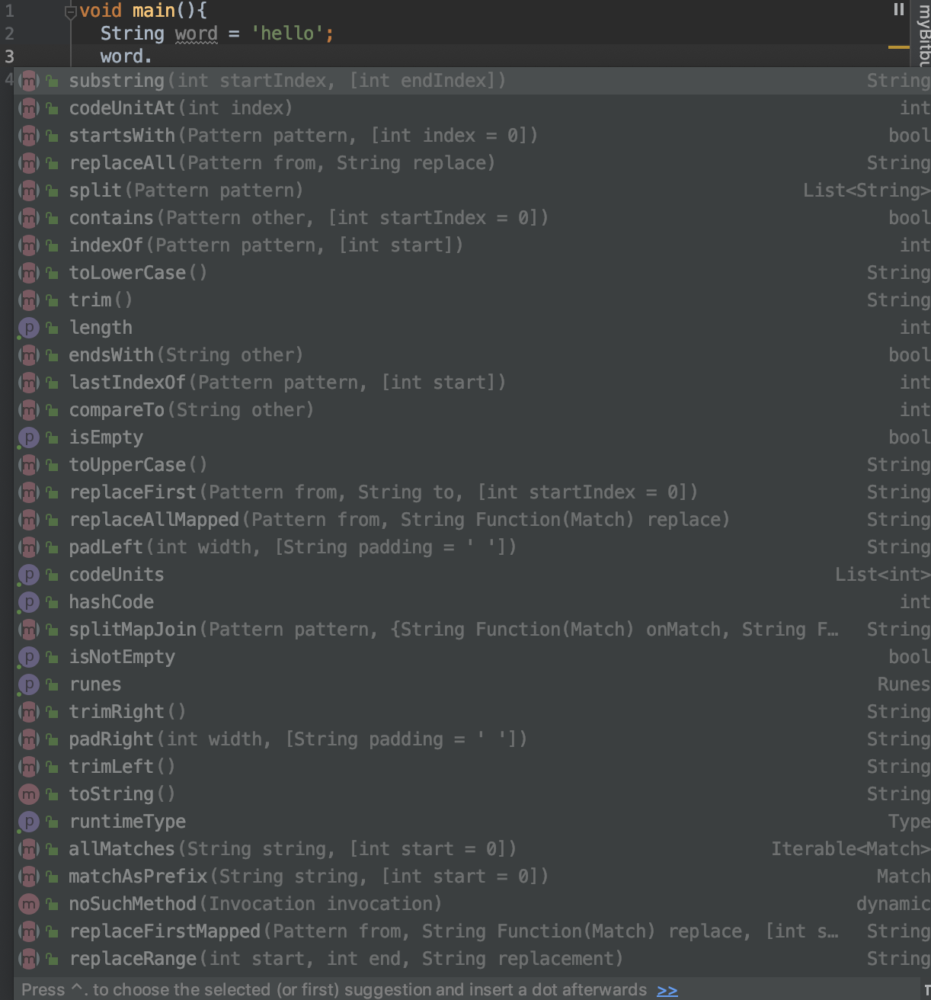

# LESSON 1

## Map
Key -> Pair values
```
Map<int,String> map = {
    1:'One',
    2:'Two',
    3:'Three',
    15:'Lol'
};
print(map[15]); // prints _'Lol'_
map[17] = 'Seventeen';
```

JSON
Map<String,dynamic>

## Functions on objects

There are many built in functions for primitive types and objects.

```
String word = 'hello';
word.
```


```
List<int> numbers = [1,2,3,4,5];
numbers.forEach((number)=>print(number));
```


## Syntax
Press dot and check with Android Studio or with VS Studio code what is offered.
You can also check the documentation for the type.


String
https://api.dart.dev/stable/2.7.1/dart-core/String-class.html

int
https://api.dart.dev/stable/2.7.1/dart-core/int-class.html

double
https://api.dart.dev/stable/2.7.1/dart-core/double-class.html

bool
https://api.dart.dev/stable/2.7.1/dart-core/bool-class.html

List
https://api.dart.dev/stable/2.7.1/dart-core/List-class.html

Map
https://api.dart.dev/stable/2.7.1/dart-core/Map-class.html


## Cases that we use often

#### String

.contains('') => bool
.toLowerCase()
.toUpperCase()

#### List

.add(
.forEach(
.remove

#### Map
.containsKey(
.remove(
.forEach(


## Homework
1. Create a function that takes a String and int. String is name, and int is height.
Add those entries in a map for that name;
2. Create another function that will be able to return how high is person. It takes only string as parameter.
3. CAF that will return all people that are of the height entered. It takes only int as parameter.
4. CAF that will delete an entry for name. Takes String.
5. CAF that prints all entries.


### Za one koji zele vise
1. Create the same task, but with List.
2. *www.ecosia.org*
3. return everyone who is in height span (145 - 190)
